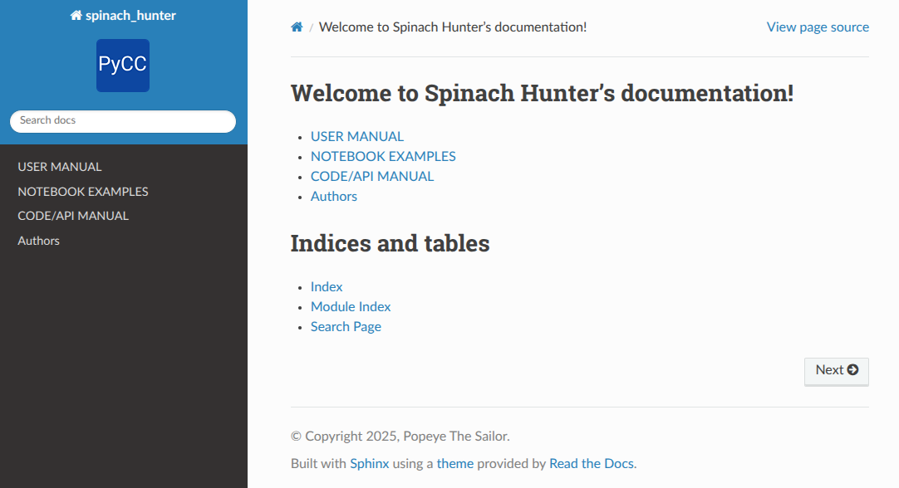

=======================================
Cookiecutter PyPackage (custom version)
=======================================

A `cookiecutter <https://github.com/cookiecutter/cookiecutter>`__ template for a Python package that integrates pytest, Sphinx, and github workflows for publishing to github.io and auto testng.

V1 of readme from `github.com/audreyfeldroy/cookiecutter-pypackage <github.com/audreyfeldroy/cookiecutter-pypackage/>`__.

.. .. contents::

*   GitHub repo: `github.com/ranjanmannige/cookiecutter-pypackage/ <https://github.com/ranjanmannige/cookiecutter-pypackage/>`__
*   Free software: MIT license

Features
========

*   Testing setup with pytest
*   Sphinx documentation, including creation of views for code manual and notebooks
*   GitHub Actions for publishing to `username.github.io/project_name`
*   GitHub Actions testing: Setup to easily test for Python 3.10, 3.11, 3.12, and 3.13
*   Auto-release to `PyPI <https://pypi.python.org/pypi>`__ when you push a new tag to master (optional)
*   Command line interface using Typer

Quickstart
==========

Install the latest Cookiecutter if you haven't installed it yet:

.. code-block:: bash

    $ pip install -U cookiecutter

Generate a Python package project:

.. code-block:: bash

    $ cookiecutter https://github.com/ranjanmannige/cookiecutter-pypackage.git

OR

.. code-block:: bash

    $ python -m cookiecutter https://github.com/ranjanmannige/cookiecutter-pypackage.git

You will be asked to answer nine questions. Here is an example:

.. code-block:: none

    [1/9] full_name (Ranjan Mannige): Popeye The Sailor
    [2/9] email (ranjanmannige@gmail.com): popeye@spinach.com
    [3/9] github_username (ranjanmannige): popeyelovesspinach
    [4/9] project_name (Python Boilerplate): Spinach Finder
    [5/9] project_slug (spinach_finder):
    [6/9] pypi_package_name (spinach_finder):
    [7/9] project_short_description (Python Boilerplate contains all the boilerplate 
          you need to create a Python package.): Spinach Finder is a magical app 
          that finds spinach for Popeye!
    [8/9] pypi_username (popeyelovesspinach):
    [9/9] first_version (0.1.0):

Then (assuming that you are in a virtual environment or venv):

.. code-block:: bash

    $ cd spinach_finder
    $ pip install -e .
    # Tests
    $ pip install pytest
    $ pytest

If the functions/classes/modules in your python files (presumably stored in `src/{{cookiecutter.project_slug}}/`) are 
documented using `docstrings <https://google.github.io/styleguide/pyguide.html#docstrings>`__, they can be packaged in 
Sphinx the documentation (i.e., they can be referenced in `docs/reference.rst`; an example is shown in the template). 

Generating documentation
========================

You can auto-generate documentation by:

.. code-block:: bash

    $ cd docs
    # Sphinx requires some extra installs
    $ pip install -r requirements.txt
    $ make html

Continuing with our Popeye example used above, the commands above should create a 
`docs/_build/html/X.html` file for each `X.rst` stored in `docs/`. Here is an example 
of the `docs/_build/html/index.html` file that was created from the `docs/index.rst` file:

Once compiled using Sphinx via git workflow (see `.github/workflows/SphinxBuild.yml`), 
full documentation should be available at: 
`popeyelovesspinach.github.io/spinach_finder/ <https://popeyelovesspinach.github.io/spinach_finder/>`__.

Next steps
==========

*   `Register <https://packaging.python.org/tutorials/packaging-projects/#uploading-the-distribution-archives>`__ your project with PyPI.
*   Release your package!

